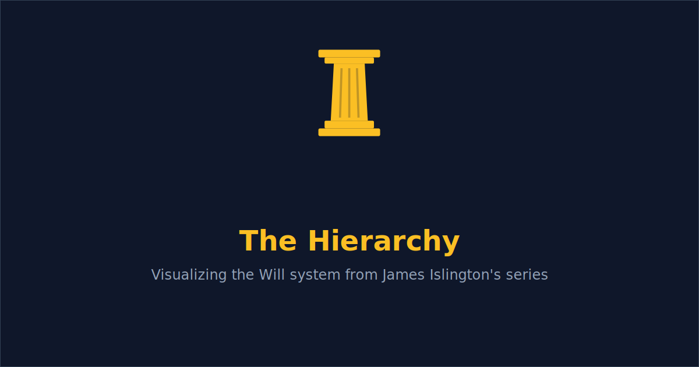

# The Hierarchy

An interactive visualization of the Will system from James Islington's *Hierarchy* book series (*The Will of the Many* and *The Strength of the Few*).

**[Live Demo →](https://burntsouup.github.io/HierarchySeries/)**



## What is this?

In the Catenan Republic, citizens are organized into an 8-tier hierarchy where each tier cedes half its accumulated Will — life energy — to the tier above. The structure follows a strict mathematical pattern:

- **Factorial populations** — the population at each rank equals R! (40,320 Octavii at the base, 1 Princeps at the top)
- **Decreasing feeding ratios** — 8 Octavii feed 1 Septimus, 7 Septimii feed 1 Sextus, and so on down to 2 Dimidii feeding 1 Princeps
- **50% cede rate** — every tier gives up half, the Princeps keeps everything

This app lets you explore that system: click on any tier to see its stats, take a guided tour, or toggle the spoiler-gated character overlay to see where named characters fall in the pyramid.

## Features

- **Width-scaled pyramid** — one node per tier, sized proportionally to represent population
- **Variable edge counts** — the number of animated lines between tiers matches the canonical feeding ratio (8, 7, 6, 5, 4, 3, 2)
- **Totius / Not Totius** — both the full power (before ceding) and retained power (after ceding) are displayed, matching the in-book terminology
- **Guided tour** — 10-step walkthrough of the entire hierarchy from Octavus to Princeps
- **Spoiler-gated characters** — toggle Book 1 or Book 2 characters onto the pyramid, filterable by branch (Governance, Military, Religion)
- **Detailed info panel** — click any tier for lore, analogies, Will math, and character placements
- **Canonical math** — all numbers are derived from the "Catenan Rankings" image in the book and verified against community analysis

## Tech Stack

- [React](https://react.dev/) + [Vite](https://vite.dev/)
- [React Flow](https://reactflow.dev/) (@xyflow/react) for the interactive diagram
- [Tailwind CSS](https://tailwindcss.com/) for styling

## Running Locally

```bash
npm install
npm run dev
```

## License

This is a fan project. *The Hierarchy* series is written by James Islington and published by Saga Press. All book content, character names, and world-building belong to the author.
